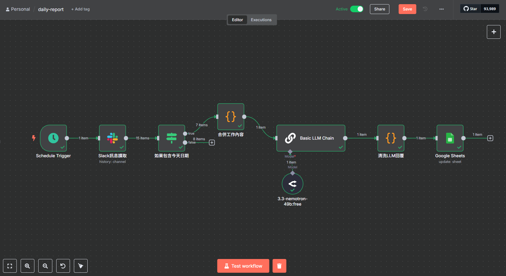

# n8n-daily-report-workflow



## Schedule Trigger Node

Used to set the time trigger (note that the correct timezone must be specified when starting Docker)

## Slack API

[https://api.slack.com/apps/](https://api.slack.com/apps/)


Generate token and set permissions (Scope)


Return to the Slack node in n8n and paste the Access Token


Back to Slack API:

1. In the left menu, click on "OAuth & Permissions" under "Features"
2. Add appropriate permission scopes in the "Scopes" section, such as:
    - channels:history (read channel messages)
    - groups:history (read private channel messages)
    - users:read (read user information)

In Slack, go to the channel where you need to read messages:

```bash
/invite @bot_name
```

## If Node

Set the condition when `text` contains `{{String($now.format('yyyyMMdd'))}}`

The String() wrapper isn't always necessary, but if you need to add or subtract days, the native format would be treated as an integer, so you need to wrap it to force conversion back to String type.

Connect this to a JS Code node to consolidate the messages.

## OpenRouter Node

After obtaining an API-Key from OpenRouter, set up the Credential.

Configure User/System prompts.

Similarly, connect this to a JS Code node to clean the LLM-returned text into proper JSON.

## Google Sheet Node

Go to the GCP console Marketplace and search for `Google sheet api` and `Google drive api` and enable them.


### Setting up OAuth Consent Screen

1. In the left menu, select "APIs & Services > OAuth consent screen"
2. Choose "External"
3. Fill in the application name, support email, and other information
4. Select "Test users" or "Public" for the target audience (for personal use, "Test users" is sufficient)
5. Save

### Create OAuth Client ID

1. In the left menu, select "Credentials" → "Create credentials" → "OAuth client ID"
2. Choose "Web application"
3. Name it (e.g. n8n-sheets)
4. Paste the "OAuth Redirect URL" from your n8n interface's Google credential settings page in "Authorized redirect URIs"
    - For example: **`https://<your-n8n-url>/rest/oauth2-credential/callback`**
    - For local testing, you can use an HTTPS URL generated by ngrok
5. After creation, you'll see the "Client ID" and "Client Secret"
6. Remember to add your Gmail to Test Users in the Audience section

